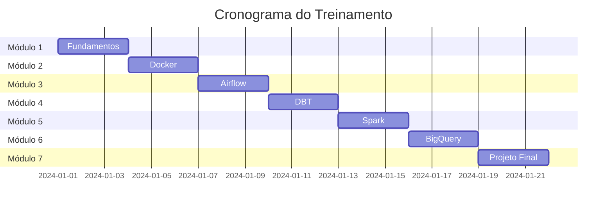
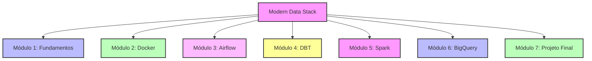

# 🚀 Treinamento Modern Data Stack

## 📋 Visão Geral
Este treinamento completo sobre Modern Data Stack foi desenvolvido para profissionais que desejam dominar as principais ferramentas e práticas do ecossistema moderno de dados. Com foco em casos práticos de análise de voos e hospedagens, o treinamento oferece uma experiência hands-on com as tecnologias mais relevantes do mercado.

## 🎯 Objetivos
- Dominar os fundamentos da Modern Data Stack
- Desenvolver pipelines de dados completos
- Implementar boas práticas de engenharia de dados
- Criar soluções escaláveis e manuteníveis

## 🔍 Público-Alvo
- Engenheiros de Dados
- Analistas de Dados
- Cientistas de Dados
- Desenvolvedores interessados em dados

## 📚 Pré-requisitos
- Conhecimento básico de Python
- Familiaridade com SQL
- Noções de linha de comando
- Conceitos básicos de Cloud Computing

## ⚙️ Tecnologias Abordadas
- Docker e Docker Compose
- Apache Airflow
- Apache Spark
- Google BigQuery
- DBT (Data Build Tool)
- Metabase

## 📅 Cronograma

%%{init: { "themeVariables": { "fontFamily": "Arial", "fontSize": "10px" } }}%%


## 🗺️ Estrutura do Treinamento

%%{init: { "themeVariables": { "fontFamily": "Arial", "fontSize": "10px" } }}%%


## 📂 Módulos

### [Módulo 1: Fundamentos da Modern Data Stack](modulos/01-fundamentos)
- Introdução à Modern Data Stack
- Arquitetura de Dados Moderna
- Conceitos Fundamentais
- Setup do Ambiente

### [Módulo 2: Docker para Ambientes de Dados](modulos/02-docker)
- Fundamentos do Docker
- Containerização de Aplicações
- Docker Compose
- Boas Práticas

### [Módulo 3: Apache Airflow - Orquestração de Dados](modulos/03-airflow)
- Fundamentos do Airflow
- Desenvolvimento de DAGs
- Operadores e Sensores
- Monitoramento

### [Módulo 4: DBT - Transformação de Dados](modulos/04-dbt)
- Fundamentos do DBT
- Modelagem de Dados
- Testes e Documentação
- Boas Práticas

### [Módulo 5: Apache Spark - Processamento Distribuído](modulos/05-spark)
- Fundamentos do Spark
- PySpark
- Otimização
- Integração

### [Módulo 6: BigQuery e Data Warehouse](modulos/06-bigquery)
- Fundamentos de DW
- BigQuery
- Otimização
- Custos

### [Módulo 7: Projeto Final Integrado](modulos/07-projeto-final)
- Sistema Completo
- Integração
- Documentação
- Apresentação

## 🛠️ Setup do Ambiente

### Requisitos de Sistema
- Docker 24.0+
- Python 3.8+
- Git
- 8GB RAM (mínimo)
- 50GB espaço em disco

### Instalação
1. Clone o repositório
```bash
git clone https://github.com/seu-usuario/modern-data-stack-training.git
cd modern-data-stack-training
```

2. Configure o ambiente
```bash
python -m venv venv
source venv/bin/activate  # Linux/Mac
.\venv\Scripts\activate   # Windows
pip install -r requirements.txt
```

3. Inicie os serviços
```bash
docker-compose up -d
```

4. Verifique a instalação
```bash
python verify_environment.py
```

## 📊 Avaliação
- Exercícios Práticos: 30%
- Quizzes: 20%
- Projeto Final: 50%

## 📚 Recursos Adicionais
- [Modern Data Stack Blog](https://www.moderndatastack.xyz/blog)
- [Data Engineering Roadmap](https://roadmap.sh/data-engineer)
- [DBT Best Practices](https://docs.getdbt.com/best-practices)
- [Airflow Documentation](https://airflow.apache.org/docs/)

## 👨‍🏫 Suporte
- Discord: [Link para servidor]
- GitHub Issues: [Link para issues]
- Email: suporte@moderndatastack.com

## 📜 Licença
Este treinamento é distribuído sob a licença MIT. Veja o arquivo `LICENSE` para mais detalhes.

## 🙏 Agradecimentos
- Comunidade Open Source
- Contribuidores
- Revisores
- Alunos 