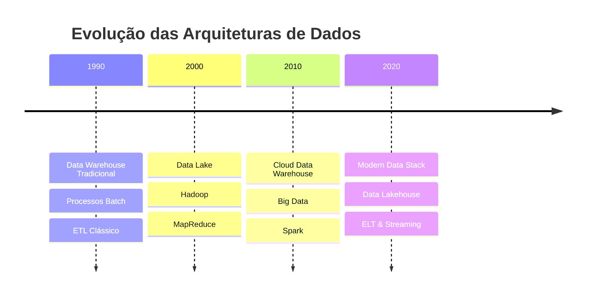
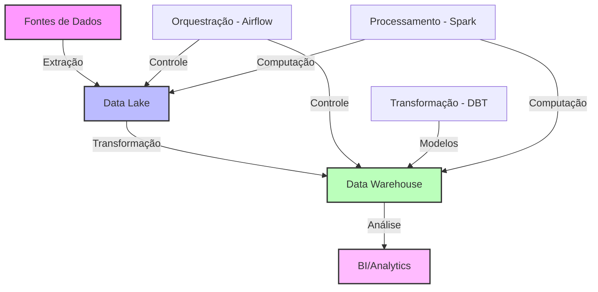

# 📚 Módulo 1: Fundamentos da Modern Data Stack

## 🔍 Sobre este Módulo
Este módulo aborda os conceitos fundamentais da Modern Data Stack, apresentando a evolução das arquiteturas de dados e os principais componentes que formam uma stack moderna de dados.

## 📋 Índice

- [Objetivos](#-objetivos-do-módulo)
- [Evolução das Arquiteturas](#1-evolução-das-arquiteturas-de-dados)
- [Componentes da Modern Data Stack](#2-componentes-da-modern-data-stack)
- [Conceitos Fundamentais](#3-conceitos-fundamentais)
- [Exercícios Práticos](#-exercícios-práticos)
- [Recursos Adicionais](#-recursos-adicionais)
- [Quiz](#-quiz)
- [Projeto do Módulo](#-projeto-do-módulo)

## 🎯 Objetivos do Módulo
- Compreender a evolução das arquiteturas de dados
- Identificar os componentes principais da Modern Data Stack
- Entender os conceitos de Data Lakehouse
- Conhecer as melhores práticas de arquitetura de dados

## 📋 Conteúdo

### 1. Evolução das Arquiteturas de Dados

%%{init: { "themeVariables": { "fontFamily": "Arial", "fontSize": "10px" } }}%%

#### 1.1 Desafios Históricos
- Escalabilidade
- Custos de infraestrutura
- Complexidade de manutenção
- Tempo de processamento
- Qualidade dos dados

#### 1.2 Soluções Modernas
- Cloud-first
- Serverless
- Pay-as-you-go
- Automação
- Governança integrada

### 2. Componentes da Modern Data Stack

%%{init: { "themeVariables": { "fontFamily": "Arial", "fontSize": "10px" } }}%%

#### 2.1 Camadas Principais
1. **Ingestão de Dados**
   - Batch vs Streaming
   - APIs e Conectores
   - Formatos de dados

2. **Armazenamento**
   - Data Lake
   - Data Warehouse
   - Data Lakehouse

3. **Processamento**
   - ETL vs ELT
   - Batch Processing
   - Stream Processing

4. **Transformação**
   - SQL vs Python
   - DBT
   - Data Quality

5. **Visualização**
   - Business Intelligence
   - Dashboards
   - Self-service Analytics

### 3. Conceitos Fundamentais

#### 3.1 Data Lakehouse
- Combinação de Data Lake e Data Warehouse
- Benefícios e trade-offs
- Casos de uso

#### 3.2 Governança de Dados
- Metadados
- Linhagem
- Segurança
- Compliance

#### 3.3 Arquiteturas Modernas
- Lambda Architecture
- Kappa Architecture
- Medallion Architecture

## 💻 Exercícios Práticos

### Exercício 1: Análise de Arquitetura
Analise a arquitetura de dados da sua empresa ou de um caso de estudo e identifique:
- Componentes principais
- Pontos de melhoria
- Oportunidades de modernização

### Exercício 2: Design de Solução
Desenhe uma arquitetura Modern Data Stack para um e-commerce que precisa:
- Processar dados de vendas em tempo real
- Análise de comportamento do cliente
- Recomendações de produtos
- Relatórios financeiros

## 📚 Recursos Adicionais

### Artigos
- [The Modern Data Stack](https://www.thoughtworks.com/insights/blog/data-strategy/modern-data-stack)
- [Evolution of the Data Lake](https://www.databricks.com/blog/2020/01/30/what-is-a-data-lakehouse.html)

### Vídeos
- [Modern Data Stack Explained](https://www.youtube.com/watch?example1)
- [Data Lakehouse Architecture](https://www.youtube.com/watch?example2)

### Documentação
- [Databricks Delta Lake](https://docs.databricks.com/delta/index.html)
- [Apache Iceberg](https://iceberg.apache.org/)

## ✅ Quiz

1. Qual a principal diferença entre ETL e ELT?
2. Como o conceito de Data Lakehouse resolve os problemas do Data Lake tradicional?
3. Quais são os benefícios da arquitetura Medallion?
4. Por que a Modern Data Stack é considerada mais ágil que arquiteturas tradicionais?
5. Como a governança de dados se integra com a Modern Data Stack?

## 🎯 Projeto do Módulo

Desenvolva um documento de arquitetura para uma Modern Data Stack que inclua:
1. Diagrama de arquitetura
2. Justificativa para escolha de componentes
3. Estratégia de governança
4. Estimativa de custos
5. Plano de implementação

## 📝 Avaliação
- Participação nas discussões: 20%
- Exercícios práticos: 30%
- Quiz: 20%
- Projeto do módulo: 30%

## 🔄 Próximos Passos
No próximo módulo, mergulharemos no Docker para ambientes de dados, onde você aprenderá a containerizar e orquestrar seus serviços de dados. 