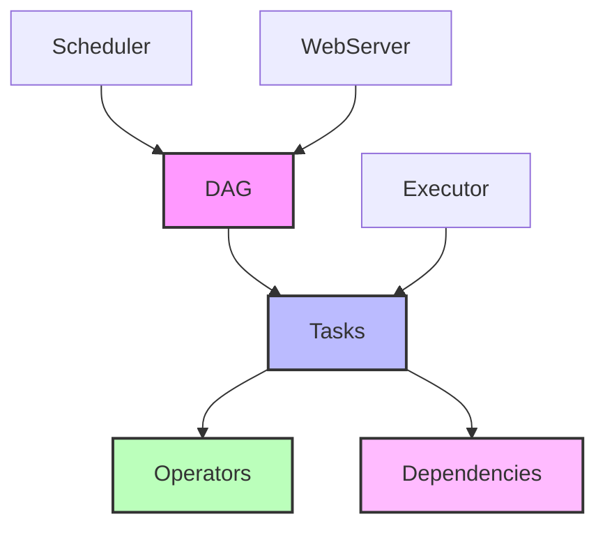
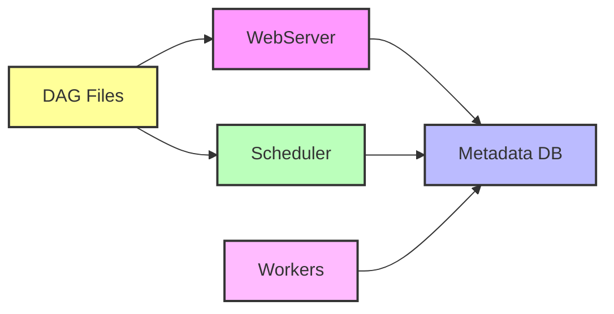

# 🌪️ Módulo 3: Apache Airflow - Orquestração de Dados

## 🔍 Sobre este Módulo
Este módulo aborda os conceitos e práticas do Apache Airflow para orquestração de dados, focando no desenvolvimento de DAGs eficientes e na implementação de boas práticas de orquestração.

## 📋 Índice

- [Objetivos](#-objetivos-do-módulo)
- [Fundamentos do Airflow](#1-fundamentos-do-airflow)
- [Desenvolvimento de DAGs](#2-desenvolvimento-de-dags)
- [Boas Práticas](#3-boas-práticas)
- [Integrações Avançadas](#4-integrações-avançadas)
- [Exercícios Práticos](#-exercícios-práticos)
- [Recursos Adicionais](#-recursos-adicionais)

## 🎯 Objetivos do Módulo
- Compreender os conceitos fundamentais do Apache Airflow
- Desenvolver DAGs eficientes e escaláveis
- Implementar boas práticas de orquestração
- Integrar Airflow com outras ferramentas

## 📋 Conteúdo

### 1. Fundamentos do Airflow

%%{init: { "themeVariables": { "fontFamily": "Arial", "fontSize": "10px" } }}%%


#### 1.1 Conceitos Básicos
- DAGs (Directed Acyclic Graphs)
- Tasks e Operators
- Dependencies
- Scheduling
- Executors
- XCom

#### 1.2 Arquitetura do Airflow

%%{init: { "themeVariables": { "fontFamily": "Arial", "fontSize": "10px" } }}%%


### 2. Desenvolvimento de DAGs

#### 2.1 Estrutura Básica de uma DAG
```python
from airflow import DAG
from airflow.operators.python import PythonOperator
from datetime import datetime, timedelta

default_args = {
    'owner': 'modern_data_stack',
    'depends_on_past': False,
    'start_date': datetime(2024, 1, 1),
    'email_on_failure': False,
    'email_on_retry': False,
    'retries': 1,
    'retry_delay': timedelta(minutes=5),
}

with DAG(
    'exemplo_dag',
    default_args=default_args,
    description='Uma DAG de exemplo',
    schedule_interval='@daily',
) as dag:
    
    def task_function():
        print("Executando tarefa...")
    
    task = PythonOperator(
        task_id='exemplo_task',
        python_callable=task_function,
    )
```

#### 2.2 Principais Operators
- PythonOperator
- BashOperator
- PostgresOperator
- BigQueryOperator
- DockerOperator
- DBTOperator
- SparkSubmitOperator

#### 2.3 Task Dependencies
```python
task1 >> task2 >> task3  # Sequencial
[task1, task2] >> task3  # Multiple Dependencies
task1 >> [task2, task3]  # Parallel Tasks
```

### 3. Boas Práticas

#### 3.1 Estrutura de Projeto
```
dags/
├── common/
│   ├── __init__.py
│   ├── constants.py
│   └── utils.py
├── configs/
│   └── connections.yml
└── pipelines/
    ├── extract/
    ├── transform/
    └── load/
```

#### 3.2 Padrões de Desenvolvimento
- Task Idempotência
- Tratamento de Erros
- Logging
- Monitoramento
- Versionamento
- Testes

### 4. Integrações Avançadas

#### 4.1 Airflow com DBT
```python
from airflow.operators.bash import BashOperator

dbt_run = BashOperator(
    task_id='dbt_run',
    bash_command='dbt run --profiles-dir /usr/app/profiles',
)

dbt_test = BashOperator(
    task_id='dbt_test',
    bash_command='dbt test --profiles-dir /usr/app/profiles',
)

dbt_run >> dbt_test
```

#### 4.2 Airflow com Spark
```python
from airflow.providers.apache.spark.operators.spark_submit import SparkSubmitOperator

spark_job = SparkSubmitOperator(
    task_id='spark_job',
    application='/path/to/job.py',
    conf={
        'spark.driver.memory': '2g',
        'spark.executor.memory': '2g'
    }
)
```

## 💻 Exercícios Práticos

### Exercício 1: DAG Básica
1. Criar uma DAG que:
   - Extrai dados de uma API
   - Salva em CSV
   - Carrega no PostgreSQL
   - Envia notificação de conclusão

### Exercício 2: Integração DBT
1. Desenvolver uma DAG que:
   - Executa transformações DBT
   - Valida qualidade dos dados
   - Gera documentação
   - Monitora performance

### Exercício 3: Pipeline Completo
1. Implementar um pipeline que:
   - Coleta dados de múltiplas fontes
   - Processa com Spark
   - Carrega no BigQuery
   - Executa testes de qualidade
   - Gera relatórios

## 📚 Recursos Adicionais

### Documentação
- [Apache Airflow Documentation](https://airflow.apache.org/docs/)
- [Best Practices](https://airflow.apache.org/docs/apache-airflow/stable/best-practices.html)
- [Common Pitfalls](https://airflow.apache.org/docs/apache-airflow/stable/common-pitfalls.html)

### Artigos
- [Airflow Design Principles](https://medium.com/airflow-design-principles)
- [Testing Airflow DAGs](https://medium.com/testing-airflow-dags)

### Vídeos
- [Airflow Fundamentals](https://www.youtube.com/watch?example1)
- [Advanced Airflow Patterns](https://www.youtube.com/watch?example2)

## ✅ Quiz

1. O que é uma DAG e por que é importante no Airflow?
2. Quais são os principais componentes da arquitetura do Airflow?
3. Como implementar idempotência em tasks do Airflow?
4. Qual a diferença entre os diversos tipos de Executors?
5. Como o Airflow gerencia dependências entre tasks?

## 🎯 Projeto do Módulo

### Pipeline de Análise de Voos

Desenvolva um pipeline completo que:

1. Extrai dados de APIs de voos
   - Status de voos
   - Preços de passagens
   - Informações de aeroportos

2. Processa e transforma os dados
   - Limpeza e padronização
   - Agregações
   - Enriquecimento

3. Carrega em um Data Warehouse
   - Modelagem dimensional
   - Histórico de preços
   - Métricas de performance

4. Implementa monitoramento
   - Alertas de falha
   - Métricas de SLA
   - Logs detalhados

Requisitos:
- Código limpo e documentado
- Testes automatizados
- Tratamento de erros
- Monitoramento completo
- Documentação detalhada

## 📝 Avaliação
- Exercícios práticos: 30%
- Quiz: 20%
- Projeto do módulo: 50%

## 🔄 Próximos Passos
No próximo módulo, aprenderemos sobre DBT (Data Build Tool) para transformação de dados de forma eficiente e escalável. 