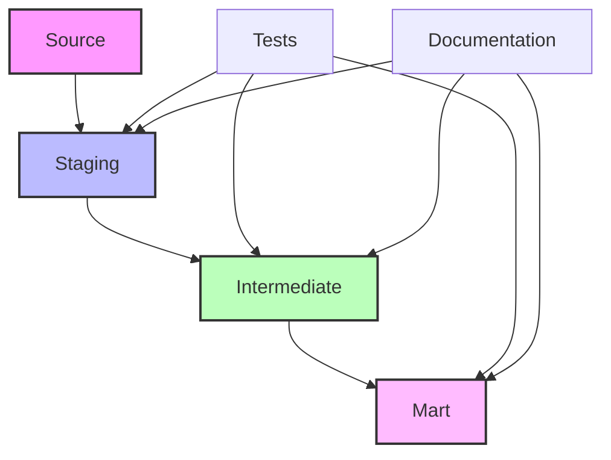

# 🔄 Módulo 4: DBT - Transformação de Dados

## 🔍 Sobre este Módulo
Este módulo aborda os conceitos e práticas do DBT (Data Build Tool) para transformação de dados, focando no desenvolvimento de modelos eficientes, testes e documentação.

## 📋 Índice

- [Objetivos](#-objetivos-do-módulo)
- [Fundamentos do DBT](#1-fundamentos-do-dbt)
- [Desenvolvimento de Modelos](#2-desenvolvimento-de-modelos)
- [Testes e Documentação](#3-testes-e-documentação)
- [Macros e Packages](#4-macros-e-packages)
- [Modelagem Dimensional](#5-modelagem-dimensional)

## 🎯 Objetivos do Módulo
- Compreender os fundamentos do DBT
- Desenvolver modelos de transformação eficientes
- Implementar testes e documentação
- Criar pipelines de transformação completos

## 📋 Conteúdo

### 1. Fundamentos do DBT

%%{init: { "themeVariables": { "fontFamily": "Arial", "fontSize": "10px" } }}%%


#### 1.1 Conceitos Básicos
- Modelos
- Materialização
- Referências
- Macros
- Testes
- Documentação
- Seeds

#### 1.2 Estrutura de Projeto DBT

```
dbt_project/
├── dbt_project.yml
├── packages.yml
├── profiles.yml
├── README.md
├── analysis/
├── macros/
├── models/
│   ├── staging/
│   ├── intermediate/
│   └── marts/
├── seeds/
└── tests/
    ├── generic/
    └── singular/
```

### 2. Desenvolvimento de Modelos

#### 2.1 Modelo Básico
```sql
-- models/staging/stg_voos.sql
WITH source AS (
    SELECT * FROM {{ source('voos', 'raw_voos') }}
),

renamed AS (
    SELECT
        numero_voo,
        origem,
        destino,
        data_partida,
        data_chegada,
        preco,
        data_processamento
    FROM source
)

SELECT * FROM renamed
```

#### 2.2 Configurações de Modelo
```yaml
# dbt_project.yml
models:
  modern_data_stack:
    staging:
      +materialized: view
    intermediate:
      +materialized: ephemeral
    marts:
      +materialized: table
      +schema: analytics
```

### 3. Testes e Documentação

#### 3.1 Testes Genéricos
```yaml
# models/schema.yml
version: 2

models:
  - name: stg_voos
    description: "Dados brutos de voos"
    columns:
      - name: numero_voo
        description: "Número único do voo"
        tests:
          - unique
          - not_null
      - name: origem
        description: "Código do aeroporto de origem"
        tests:
          - not_null
          - relationships:
              to: ref('dim_aeroportos')
              field: codigo_aeroporto
```

#### 3.2 Testes Singulares
```sql
-- tests/singular/test_preco_positivo.sql
SELECT
    numero_voo,
    preco
FROM {{ ref('stg_voos') }}
WHERE preco <= 0
```

#### 3.3 Documentação
```yaml
# models/marts/schema.yml
version: 2

models:
  - name: fct_voos
    description: "Tabela fato de voos"
    columns:
      - name: voo_id
        description: "Identificador único do voo"
      - name: numero_voo
        description: "Número do voo"
      - name: origem_id
        description: "ID do aeroporto de origem"
      - name: destino_id
        description: "ID do aeroporto de destino"
      - name: data_partida
        description: "Data e hora da partida"
      - name: data_chegada
        description: "Data e hora da chegada"
      - name: preco
        description: "Preço da passagem"
```

### 4. Macros e Packages

#### 4.1 Macro Personalizada
```sql
-- macros/calcular_duracao.sql

    ROUND(
        EXTRACT(EPOCH FROM ({{ data_chegada }} - {{ data_partida }})) / 3600.0,
        2
    )

```

#### 4.2 Packages Úteis
```yaml
# packages.yml
packages:
  - package: dbt-labs/dbt_utils
    version: 1.0.0
  - package: calogica/dbt_expectations
    version: 0.8.0
```

### 5. Modelagem Dimensional

#### 5.1 Dimensões
```sql
-- models/marts/dim_aeroportos.sql
WITH staging AS (
    SELECT * FROM {{ ref('stg_aeroportos') }}
)

SELECT
    {{ dbt_utils.generate_surrogate_key(['codigo_aeroporto']) }} as aeroporto_id,
    codigo_aeroporto,
    nome,
    cidade,
    estado,
    pais,
    latitude,
    longitude
FROM staging
```

#### 5.2 Fatos
```sql
-- models/marts/fct_voos.sql
WITH voos AS (
    SELECT * FROM {{ ref('stg_voos') }}
),

dim_origem AS (
    SELECT * FROM {{ ref('dim_aeroportos') }}
),

dim_destino AS (
    SELECT * FROM {{ ref('dim_aeroportos') }}
)

SELECT
    {{ dbt_utils.generate_surrogate_key(['v.numero_voo', 'v.data_partida']) }} as voo_id,
    v.numero_voo,
    o.aeroporto_id as origem_id,
    d.aeroporto_id as destino_id,
    v.data_partida,
    v.data_chegada,
    v.preco,
    {{ calcular_duracao('v.data_chegada', 'v.data_partida') }} as duracao_horas
FROM voos v
LEFT JOIN dim_origem o ON v.origem = o.codigo_aeroporto
LEFT JOIN dim_destino d ON v.destino = d.codigo_aeroporto
```

## 💻 Exercícios Práticos

### Exercício 1: Modelagem Básica
1. Criar modelos staging para:
   - Voos
   - Aeroportos
   - Preços
2. Implementar testes básicos
3. Documentar os modelos

### Exercício 2: Modelagem Dimensional
1. Desenvolver dimensões:
   - Aeroportos
   - Companhias Aéreas
   - Tempo
2. Criar tabelas fato:
   - Voos
   - Preços Históricos
3. Implementar testes avançados

### Exercício 3: Análises
1. Criar análises para:
   - Rotas mais populares
   - Preços médios por rota
   - Sazonalidade de preços
2. Documentar insights
3. Gerar visualizações

## 📚 Recursos Adicionais

### Documentação
- [DBT Docs](https://docs.getdbt.com/)
- [Best Practices](https://docs.getdbt.com/best-practices)
- [Style Guide](https://github.com/dbt-labs/corp/blob/main/dbt_style_guide.md)

### Artigos
- [Modern Analytics Stack](https://blog.getdbt.com/what-is-the-modern-analytics-stack/)
- [Testing in DBT](https://docs.getdbt.com/docs/building-a-dbt-project/tests)

### Vídeos
- [DBT Fundamentals](https://www.youtube.com/watch?example1)
- [Advanced DBT Patterns](https://www.youtube.com/watch?example2)

## ✅ Quiz

1. O que é materialização no DBT e quais são os tipos disponíveis?
2. Como implementar testes genéricos vs singulares?
3. Qual a diferença entre ref() e source()?
4. Como funciona o versionamento de modelos no DBT?
5. Quais são as melhores práticas para organização de modelos?

## 🎯 Projeto do Módulo

### Modern Data Stack Analytics

Desenvolva um projeto DBT completo para análise de dados de voos:

1. Modelagem
   - Staging models para dados brutos
   - Intermediate models para transformações
   - Mart models para análise

2. Testes
   - Testes de integridade
   - Testes de negócio
   - Testes de qualidade

3. Documentação
   - Descrição de modelos
   - Linhagem de dados
   - Dicionário de dados

4. Análises
   - Métricas de negócio
   - Dashboards
   - Relatórios

Requisitos:
- Código limpo e documentado
- Testes abrangentes
- Documentação completa
- Análises relevantes
- Versionamento adequado

## 📝 Avaliação
- Exercícios práticos: 30%
- Quiz: 20%
- Projeto do módulo: 50%

## 🔄 Próximos Passos
No próximo módulo, aprenderemos sobre Apache Spark para processamento distribuído de dados em larga escala. 