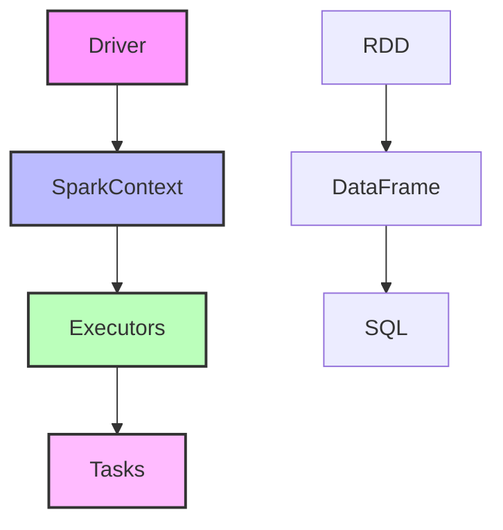
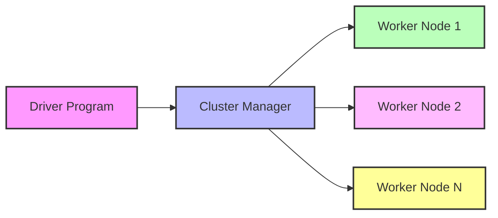

# 🔥 Módulo 5: Apache Spark - Processamento Distribuído

## 🔍 Sobre este Módulo
Este módulo aborda os conceitos e práticas do Apache Spark para processamento distribuído de dados, focando no desenvolvimento de aplicações com PySpark e na implementação de processamento eficiente em larga escala.

## 📋 Índice

- [Objetivos](#-objetivos-do-módulo)
- [Fundamentos do Spark](#1-fundamentos-do-spark)
- [PySpark DataFrame API](#2-pyspark-dataframe-api)
- [Otimização de Performance](#3-otimização-de-performance)
- [Integração com Modern Data Stack](#4-integração-com-modern-data-stack)
- [Exercícios Práticos](#-exercícios-práticos)
- [Recursos Adicionais](#-recursos-adicionais)
- [Quiz](#-quiz)
- [Projeto do Módulo](#-projeto-do-módulo)

## 🎯 Objetivos do Módulo
- Compreender os fundamentos do Apache Spark
- Desenvolver aplicações Spark em Python (PySpark)
- Implementar processamento distribuído eficiente
- Integrar Spark com outras ferramentas da stack

## 📋 Conteúdo

### 1. Fundamentos do Spark

%%{init: { "themeVariables": { "fontFamily": "Arial", "fontSize": "10px" } }}%%


#### 1.1 Conceitos Básicos
- RDD (Resilient Distributed Dataset)
- DataFrame e Dataset
- Transformações e Ações
- Particionamento
- Shuffle
- Persistência

#### 1.2 Arquitetura Spark

%%{init: { "themeVariables": { "fontFamily": "Arial", "fontSize": "10px" } }}%%


### 2. PySpark DataFrame API

#### 2.1 Operações Básicas
```python
from pyspark.sql import SparkSession
from pyspark.sql.functions import *

# Criar SparkSession
spark = SparkSession.builder \
    .appName("ExemploPySpark") \
    .getOrCreate()

# Ler dados
df = spark.read.csv("dados.csv", header=True)

# Transformações
df_transformed = df \
    .select("coluna1", "coluna2") \
    .filter(col("coluna1") > 0) \
    .groupBy("coluna2") \
    .agg(sum("coluna1").alias("total"))

# Ações
df_transformed.show()
```

#### 2.2 Window Functions
```python
from pyspark.sql.window import Window

# Definir janela
window_spec = Window \
    .partitionBy("categoria") \
    .orderBy("valor") \
    .rowsBetween(Window.unboundedPreceding, Window.currentRow)

# Aplicar função de janela
df_window = df \
    .withColumn("media_movel", 
                avg("valor").over(window_spec))
```

### 3. Otimização de Performance

#### 3.1 Estratégias de Otimização
- Particionamento
- Caching
- Broadcast Joins
- Predicate Pushdown
- Project Pushdown

#### 3.2 Exemplo de Otimização
```python
# Broadcast Join
small_df = spark.table("small_table")
large_df = spark.table("large_table")

# Broadcast a tabela menor
from pyspark.sql.functions import broadcast
optimized_df = large_df.join(broadcast(small_df), "key")

# Persistência
optimized_df.persist()
```

### 4. Integração com Modern Data Stack

#### 4.1 Spark com Airflow
```python
from airflow.providers.apache.spark.operators.spark_submit import SparkSubmitOperator

spark_job = SparkSubmitOperator(
    task_id='processar_dados',
    application='job.py',
    conf={
        'spark.driver.memory': '4g',
        'spark.executor.memory': '4g',
        'spark.executor.cores': '2'
    }
)
```

#### 4.2 Spark com Delta Lake
```python
# Configurar Delta Lake
spark = SparkSession.builder \
    .config("spark.jars.packages", "io.delta:delta-core_2.12:1.0.0") \
    .config("spark.sql.extensions", "io.delta.sql.DeltaSparkSessionExtension") \
    .config("spark.sql.catalog.spark_catalog", "org.apache.spark.sql.delta.catalog.DeltaCatalog") \
    .getOrCreate()

# Ler/Escrever Delta
df.write.format("delta").save("/path/to/delta/table")
df = spark.read.format("delta").load("/path/to/delta/table")
```

## 💻 Exercícios Práticos

### Exercício 1: Processamento Básico
1. Criar um job Spark que:
   - Lê dados de múltiplas fontes
   - Aplica transformações
   - Realiza agregações
   - Salva resultados

### Exercício 2: Análise Avançada
1. Desenvolver análises com:
   - Window Functions
   - UDFs
   - Joins complexos
   - Otimizações

### Exercício 3: Integração
1. Implementar pipeline que:
   - Integra com Airflow
   - Usa Delta Lake
   - Conecta com Data Warehouse
   - Monitora performance

## 📚 Recursos Adicionais

### Documentação
- [Apache Spark Documentation](https://spark.apache.org/docs/latest/)
- [PySpark API Reference](https://spark.apache.org/docs/latest/api/python/)
- [Delta Lake Documentation](https://docs.delta.io/latest/index.html)

### Artigos
- [Spark Performance Tuning](https://spark.apache.org/docs/latest/tuning.html)
- [Best Practices](https://spark.apache.org/docs/latest/sql-performance-tuning.html)

### Vídeos
- [Spark Fundamentals](https://www.youtube.com/watch?example1)
- [Advanced Spark Patterns](https://www.youtube.com/watch?example2)

## ✅ Quiz

1. Qual a diferença entre RDD e DataFrame no Spark?
2. Como funciona o lazy evaluation no Spark?
3. Quais são as estratégias de particionamento no Spark?
4. Como otimizar joins no Spark?
5. Quando usar cache vs persist no Spark?

## 🎯 Projeto do Módulo

### Análise de Dados de Voos em Larga Escala

Desenvolva uma aplicação Spark que:

1. Processamento
   - Ingestão de dados brutos
   - Limpeza e validação
   - Transformações complexas
   - Agregações e análises

2. Otimização
   - Particionamento adequado
   - Estratégias de cache
   - Otimização de joins
   - Monitoramento de performance

3. Integrações
   - Delta Lake para versionamento
   - Airflow para orquestração
   - Data Warehouse para armazenamento
   - Metabase para visualização

Requisitos:
- Código eficiente e otimizado
- Documentação detalhada
- Testes de performance
- Monitoramento completo
- Integração com stack

## 📝 Avaliação
- Exercícios práticos: 30%
- Quiz: 20%
- Projeto do módulo: 50%

## 🔄 Próximos Passos
No próximo módulo, aprenderemos sobre BigQuery e Data Warehouse, focando em armazenamento e análise de dados em larga escala. 