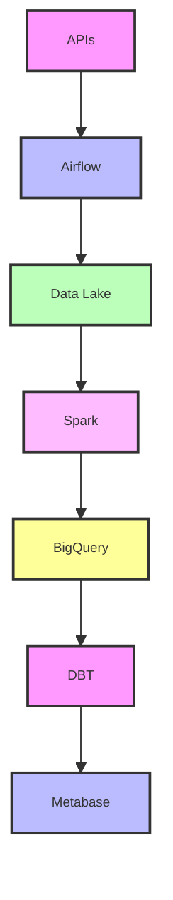
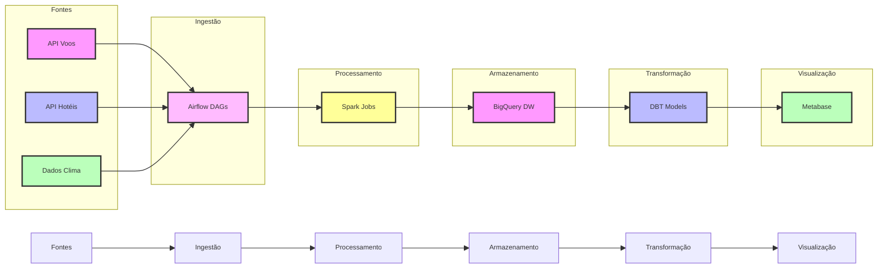

# 🎓 Módulo 7: Projeto Final Integrado

## 🔍 Sobre este Módulo
Este módulo integra todas as ferramentas e conceitos aprendidos durante o treinamento em um projeto completo de análise de voos e hospedagens, aplicando as melhores práticas da Modern Data Stack.

## 📋 Índice

- [Objetivos](#-objetivos-do-módulo)
- [Visão Geral do Projeto](#1-visão-geral)
- [Arquitetura da Solução](#2-arquitetura-da-solução)
- [Componentes do Projeto](#3-componentes-do-projeto)
- [Desenvolvimento do Projeto](#4-desenvolvimento-do-projeto)
- [Entregáveis](#5-entregáveis)
- [Critérios de Avaliação](#6-critérios-de-avaliação)

## 🎯 Objetivos do Módulo
- Integrar todas as ferramentas da Modern Data Stack
- Desenvolver um projeto completo de dados
- Implementar boas práticas de engenharia de dados
- Criar documentação profissional

## 📋 Projeto: Sistema de Análise de Voos e Hospedagens

### 1. Visão Geral



### 2. Arquitetura da Solução



### 3. Componentes do Projeto

#### 3.1 Ingestão de Dados (Airflow)
- DAGs para cada fonte de dados
- Monitoramento e alertas
- Tratamento de falhas
- Logs e auditoria

#### 3.2 Processamento (Spark)
- Limpeza de dados
- Normalização
- Enriquecimento
- Agregações

#### 3.3 Armazenamento (BigQuery)
- Modelo dimensional
- Otimização de custos
- Políticas de retenção
- Segurança

#### 3.4 Transformação (DBT)
- Modelos incrementais
- Testes de qualidade
- Documentação
- Lineage

#### 3.5 Visualização (Metabase)
- Dashboards operacionais
- Análises ad-hoc
- Relatórios automáticos
- Alertas de negócio

### 4. Desenvolvimento do Projeto

#### 4.1 Semana 1: Setup e Ingestão
1. Configuração do ambiente
2. Desenvolvimento das DAGs
3. Testes de integração
4. Documentação inicial

#### 4.2 Semana 2: Processamento e Armazenamento
1. Jobs Spark
2. Modelo dimensional
3. Otimizações
4. Testes de carga

#### 4.3 Semana 3: Transformação e Visualização
1. Modelos DBT
2. Dashboards
3. Documentação final
4. Apresentação

### 5. Entregáveis

#### 5.1 Código e Infraestrutura
```
projeto_final/
├── .env.example
├── README.md
├── docker-compose.yml
├── airflow/
│   ├── dags/
│   └── plugins/
├── spark/
│   └── jobs/
├── dbt/
│   ├── models/
│   └── tests/
├── bigquery/
│   └── schemas/
└── metabase/
    └── dashboards/
```

#### 5.2 Documentação
1. Arquitetura
2. Modelo de dados
3. Guia de operação
4. Troubleshooting

#### 5.3 Dashboards
1. Operacional
   - Status de voos
   - Ocupação de hotéis
   - Alertas

2. Análise
   - Tendências
   - Sazonalidade
   - Correlações

3. Negócio
   - KPIs
   - Previsões
   - Recomendações

### 6. Critérios de Avaliação

#### 6.1 Técnicos (40%)
- Qualidade do código
- Performance
- Escalabilidade
- Resiliência

#### 6.2 Funcionais (30%)
- Completude
- Usabilidade
- Precisão
- Tempo real

#### 6.3 Não-Funcionais (30%)
- Documentação
- Apresentação
- Inovação
- Manutenibilidade

### 7. Recursos Necessários

#### 7.1 Infraestrutura
- Docker e Docker Compose
- Cloud (GCP)
- Git
- IDE

#### 7.2 APIs
- Voos: [API Exemplo](https://aviation-edge.com)
- Hotéis: [API Exemplo](https://rapidapi.com/apidojo/api/hotels4)
- Clima: [API Exemplo](https://openweathermap.org/api)

#### 7.3 Dados
- Histórico de voos
- Cadastro de aeroportos
- Dados meteorológicos
- Eventos e feriados

### 8. Dicas e Boas Práticas

#### 8.1 Desenvolvimento
- Versionamento semântico
- Testes automatizados
- CI/CD
- Code review

#### 8.2 Operação
- Monitoramento
- Backup
- Disaster recovery
- Segurança

#### 8.3 Documentação
- Arquitetura
- APIs
- Modelos
- Processos

## 📚 Recursos Adicionais

### Documentação
- [Modern Data Stack](https://www.moderndatastack.xyz/)
- [Data Engineering Best Practices](https://github.com/awesome-data-engineering)
- [Analytics Engineering Guide](https://www.getdbt.com/analytics-engineering/)

### Artigos
- [Building Reliable Data Pipelines](https://medium.com/building-reliable-data-pipelines)
- [Data Quality Framework](https://medium.com/data-quality-framework)

### Vídeos
- [Modern Data Stack in Practice](https://www.youtube.com/watch?example1)
- [End-to-End Data Pipeline](https://www.youtube.com/watch?example2)

## 🎯 Entrega Final

### Apresentação
1. Visão geral do projeto
2. Demonstração do pipeline
3. Principais desafios
4. Resultados alcançados
5. Próximos passos

### Documentação
1. README completo
2. Diagramas atualizados
3. Guias de operação
4. Troubleshooting

### Código
1. Repositório organizado
2. Testes implementados
3. CI/CD configurado
4. Documentação inline

## 📝 Avaliação Final do Treinamento
- Projeto Final: 60%
- Participação: 20%
- Documentação: 20%

## 🎉 Conclusão e Certificação
Após a conclusão bem-sucedida do projeto e sua apresentação, você receberá um certificado detalhando todas as tecnologias e conceitos dominados durante o treinamento Modern Data Stack. 